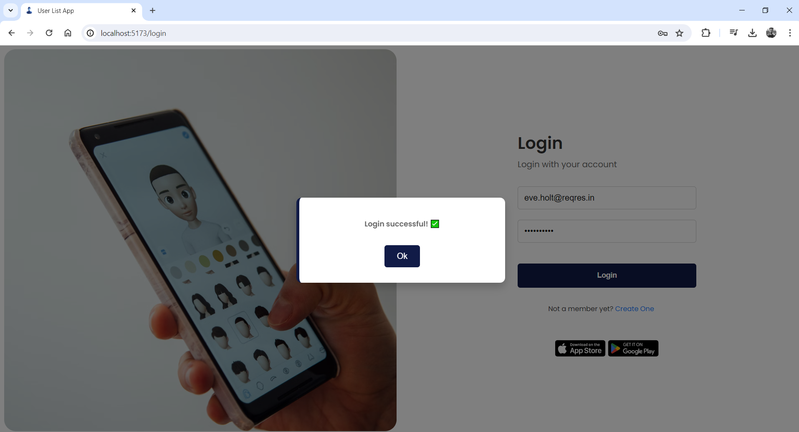

# React + Vite

This template provides a minimal setup to get React working in Vite with HMR and some ESLint rules.

Currently, two official plugins are available:

- [@vitejs/plugin-react](https://github.com/vitejs/vite-plugin-react/blob/main/packages/plugin-react/README.md) uses [Babel](https://babeljs.io/) for Fast Refresh
- [@vitejs/plugin-react-swc](https://github.com/vitejs/vite-plugin-react-swc) uses [SWC](https://swc.rs/) for Fast Refresh

# React User List App (React.js + Vanilla CSS)

#### 👌 <i>Muhammad Syaiful Rahman</i> 👌 

## Technology

- React.js
- Vanilla CSS

## Notes
✔ Menggunakan API dari https://reqres.in/  
✔ Menggunakan beberapa end point API sebagai berikut.  
-> REGISTER - SUCCESSFUL  
-> REGISTER - UNSUCCESSFUL  
-> LOGIN - SUCCESSFUL  
-> LOGIN - UNSUCCESSFUL  
-> LIST USERS  
-> SINGLE USER  
✔ Pagination  
✔ Protected Routes  
✔ Responsive Design

## Brief Steps
- Download ZIP file dari repository projek ini
- Buka folder projek dengan code editor (VSCode, sublime text, dll)
- Buka terminal code editor
- `npm i`
- `npm run dev`
- Setelah berhasil berjalan di localhost, masukkan email dan password untuk login dan register  
  <b>Register : </b>  
  `Email : eve.holt@reqres.in`  
  `Password : pistol`  

  <b>Login : </b>  
  `Email : eve.holt@reqres.in`  
  `Password : cityslicka`  
- Silahkan cek dokumentasi API reqres untuk selengkapnya https://reqres.in/  

## Screenshots (Preview)

  

  

  

  

  

  

  

